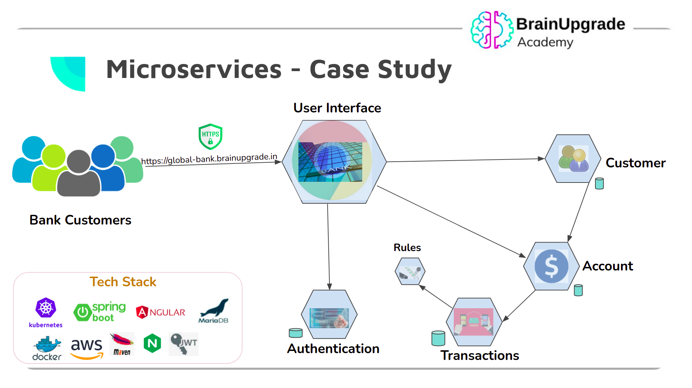

# Microservices - Global Bank

Sample Global Bank System demonstrated through a set of microservices

User Interface of Global Bank is presented to its Customers and employees via the microservice Frontend

Frontend depends on Authentication microservice to authenticate its bank's users.
Once the user logs in, based on the role he/she is shown appropriate UI pages.
When employee logs in, customer details are shown. To view accounts, click on the customer you are interested in.

To know the transactions,  click on the respective customer account.



## List of microservices

- **Frontend** - UI of the Global Bank Application
- **Authentication** - Microservice to provide Authentication REST API
- **Customer** - Microservice to provide Customer REST API
- **Account** - Microservice to provide Account REST API
- **Transaction** - Microservice to provide Transaction REST API
- **Rules** - Microservice to provide Rules REST API

## Build & Run locally

To build the app, get the source code and dev env by running below command

`kubectl apply -f https://raw.githubusercontent.com/brainupgrade-in/dockerk8s/main/app/global-bank/global-bank-dev.yaml`

Enter into the Dev environment using below command

`kubectl exec -it deploy/global-bank-dev -- bash`

Build & launch the microservices

```
cd /app/global-bank-authentication/ && mvn clean package && java -jar target/authentication.jar &
cd /app/global-bank-rules/ && mvn clean package && java -jar target/rules.jar &
cd /app/global-bank-customer/ && mvn clean package && java -jar target/customer.jar &
cd /app/global-bank-account/ && mvn clean package && java -jar target/account.jar &
cd /app/global-bank-transaction/ && mvn clean package && java -jar target/transaction.jar &
```

Modify line #6 /app/global-bank-frontend/package.json to the below

`ng serve --host 0.0.0.0 --disable-host-check --open --proxy-config proxy.conf.local.json`

and then run below to start the user interface (frontend)

`cd /app/global-bank-frontend/ && npm start &`

# Verify

Verify if the app is running as expected by running below command

`kubectl expose deploy global-bank-dev --port 80 --target-port 4200`

and then modify ingress object `k edit ingress` (replace `docker` to `global-bank-dev` on line #31), save and exit (`ESC  :wq`)

Get the HOST using below command and access it using the browser

`kubectl get ingress`

# Dockerization

Every microservice, contains Dockerfile which is used to build the microservice.  It takes care of launching dependent build tools as docker container itself and then once code is built, and then in a separate image the app is containerized thus making the final image as small as possible at the same time removing the burden on setting up build environment for any of the technologies used by the respective microservice.
You can give the image name as you deem appropriate and if you did then update k8s.yaml accordingly.

# How to Deploy

Once the app is dockerized, then use the files starting with k8s*.yaml and deploy them in your respective cloud environment.
